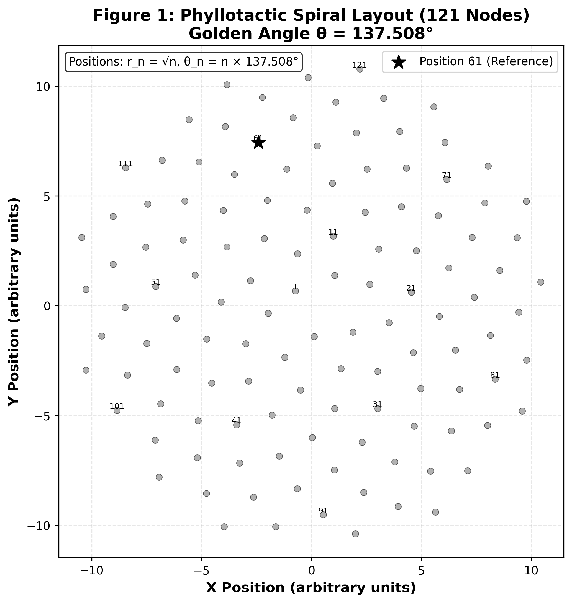

# PNM – Public Concept Repo (Phyllotactic Neural Meshing)

High-level, non‑proprietary overview of the **PNM** concept.

PNM explores electrode array layouts inspired by natural phyllotactic patterns for neural interface research.

*Example spiral pattern visualization:*

See [images/pnm_121_clean.png](images/pnm_121_clean.png) for accurate 121-node pattern with golden angle 137.507764° (exact: 360 * (1 - 1/phi), phi = (1 + sqrt(5))/2).

> ⚠️ **Toy demos only**. No full device specs, fabrication details, or clinical claims. Private work may be patent‑protected.

## Goals

- Visualize phyllotactic electrode placement.
- Generic crosstalk simulation demo.
- Educational reference for biomimetic arrays.

## What Is *Not* Here

- Real PNM specifications or performance data.
- Fabrication or biocompatibility details.
- Patent or proprietary algorithms.

Private collaboration via NDA.
