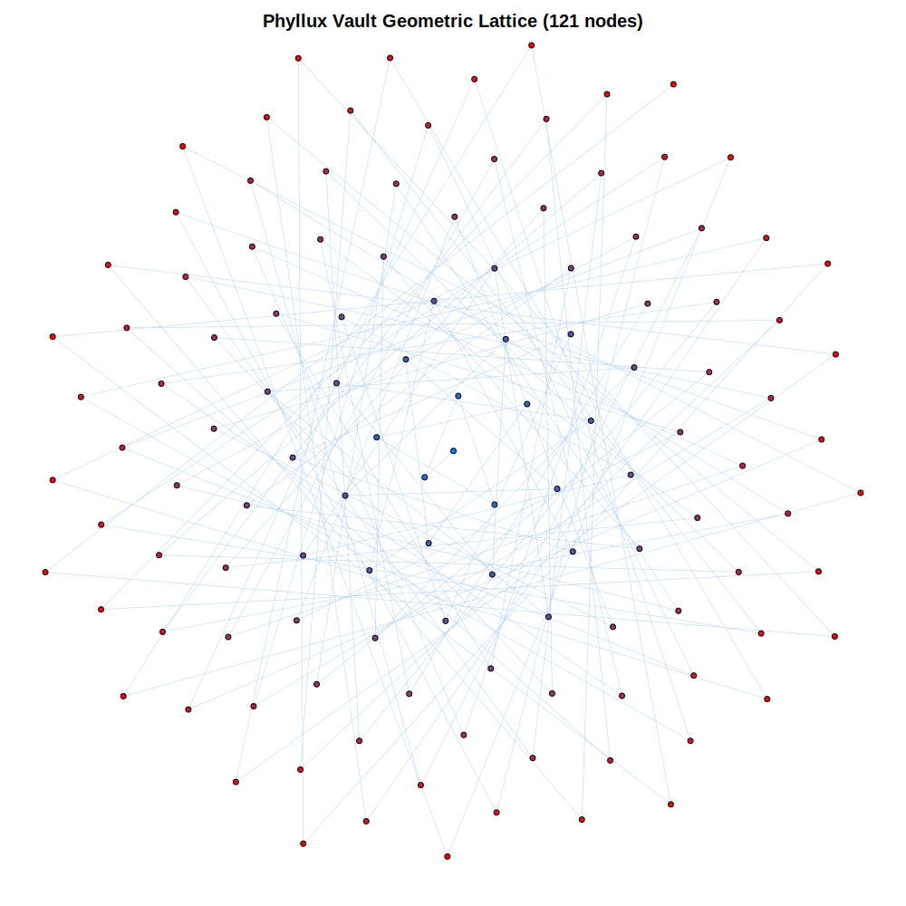
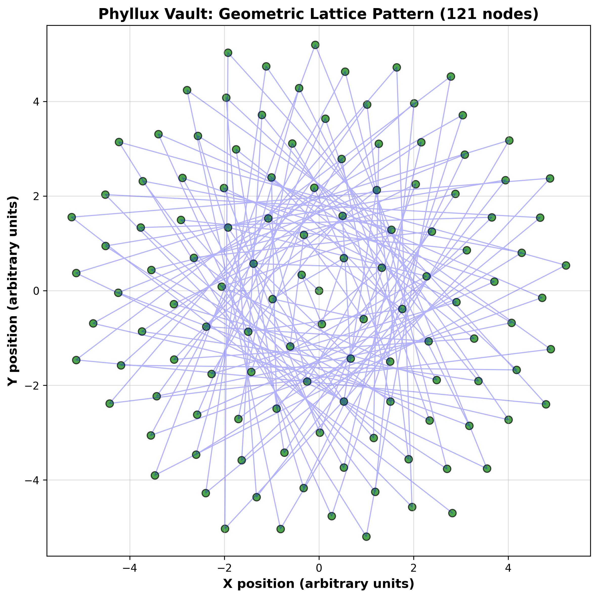

# PhiKey – Public Concept Repo (Geometric Security Protocol)
## Now Part of Phyllux Vault

> **Rebrand notice:** This technology is now branded as **Phyllux Vault**. The folder name "PhiKey-public" is retained for GitHub continuity and prior art preservation. All references to "PhiKey" in this folder should be understood as referring to the Phyllux Vault system.

This repository presents a high-level, non‑proprietary overview of the **Phyllux Vault** (formerly PhiKey) concept.

Phyllux Vault explores lattice‑like, growth‑inspired structures for cryptographic key material, drawing inspiration from natural geometric patterns like phyllotaxis.

*Example geometric lattice visualization:*

See [../images/phikey_121_clean.png](../images/phikey_121_clean.png) for accurate 121-node pattern with golden angle 137.508°.

> ⚠️ **Conceptual only**. This repo contains **toy demos** and does **not** disclose the full Phyllux Vault protocol, algorithms, or production implementation. Detailed specifications are maintained privately for potential patent protection.

> ⚠️ **NOT FOR PRODUCTION USE**. This is experimental research. Do not use this code to protect real-world data. For production security, use well-established, peer-reviewed cryptographic algorithms (AES, RSA, ECC, etc.).

## Goals (Public Repo)

- Educational demos of geometric lattice generation.
- Generic path‑traversal visualization (not a real cipher).
- Public reference for geometric cryptography concepts.

## What Is *Not* Here

- Full key generation algorithm.
- Encryption/decryption procedures.
- Security proofs or performance claims.
- Patent claim language.

Contact privately for collaboration under NDA.

---

**Part of the Phyllux Project**  
Learn more: https://github.com/phibronotchi-beep/phyllux-framework
