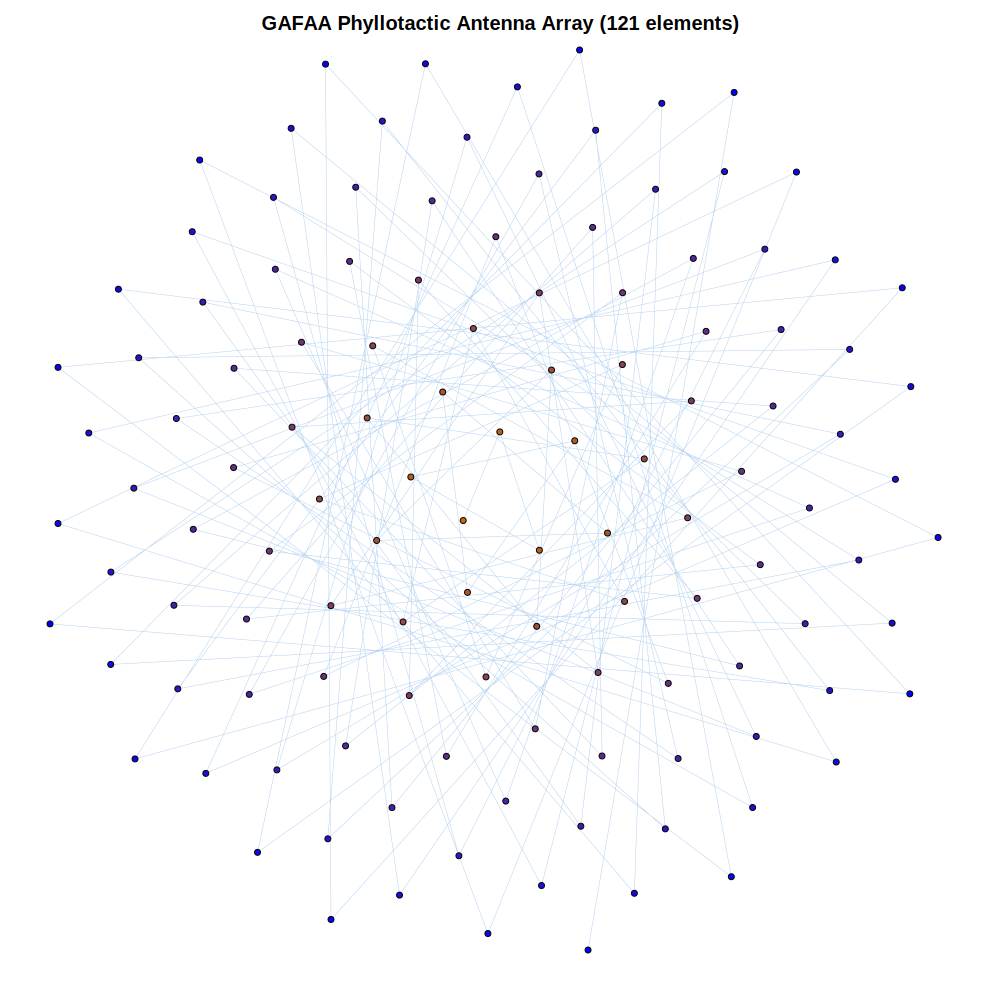
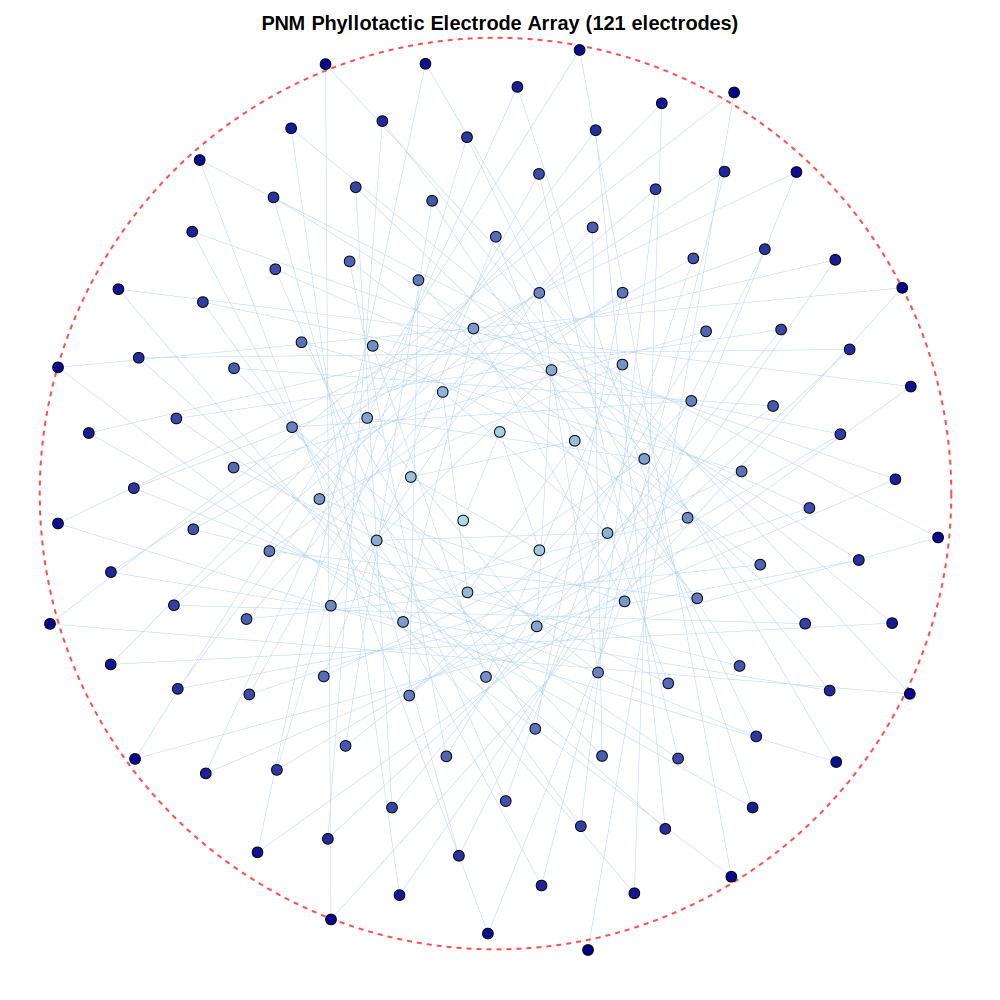

# Phyllux Biomimetic Inventions – Public Demos

**Nature's 137.508° Innovation - Multi-Domain Phyllotactic Systems**

[](LICENSE) [](.github/workflows/ci.yml) [](DISCLOSURE.md)

## Overview

This repository serves as a **public demonstration and prior art archive** for three biomimetic inventions that apply phyllotactic patterns (golden angle ~137.508°) across multiple domains: neural interfaces, wireless communications, and cryptographic security.

**Core Principle:** Unified phyllotactic system using the golden angle (θ_g = 360° × (2 - φ) ≈ 137.508°) as a geometric blueprint for multi-domain applications.

**Status:** Conceptual/educational only – not production-ready. Simulation-based; empirical validation required.

**Provisional application prepared for filing (to be filed late January 2026) – prior art established via commits (Jan 7, 2026), MIT as defensive publication, @Phibronotchi disclosures Jan 2026.**

## Ethical IP Tiers (Unified Across All Phyllux Repos)
1. Free Tier — Research, education, open-source contributions.
2. Commercial Tier — Fair royalties for profit use.
3. Pioneer Tier — Low/no-fee for high-impact players (sustainability, space, longevity orgs).
4. Community Defense — No misuse; revocation for bad faith; shared prosperity, no patent trolling.

## This Repo
Public demos and prior art for golden-angle antennas, neural meshes, Phyllux Vault crypto concepts, empirical simulations.

## Extensions as Embodiments (Unifying Other Inventions)
Extensions for biological (mycelium nets), AI/ML (mandelbrot optimizations), medical (neuroprosthetics), space (propulsion), etc. — unified under phyllotactic system per PPA embodiments.

## Cross-Repo Links
- Public Demos/Prior Art: https://github.com/phibronotchi-beep/biomimetic-inventions-public
- Core Framework: https://github.com/phibronotchi-beep/phyllux-framework
- WIP Inventions: https://github.com/phibronotchi-beep/phyllux-inventions-wip
- Full Scope Hub (Private): Phyllux-Monollux (contact for NDA access)

Conceptual/educational only – not production-ready. Seeking partners for development under ethical model.

## Featured Concept Demos

### Golden-Angle Fractal Antenna Array (GAFAA) - Phyllux Wave

Illustrative code and plots exploring phyllotactic spiral layouts for antenna element placement. These examples are intended to spark ideas about array geometry, not to specify any validated RF design or guaranteed performance.



[→ Explore GAFAA demos](https://github.com/phibronotchi-beep/biomimetic-inventions-public/tree/main/golden-angle-antenna-GAFAA-public)

### Phyllux Vault Geometric Security Protocol

Conceptual experiments with lattice growth and geometric path traversal. The aim is to visualize how spatial structure could inspire cryptographic thinking. These demos are **not** production-grade or security-reviewed cryptography and must not be used to protect real-world data.

> Note: The repository folder name `PhiKey-public` is retained for GitHub continuity and prior art preservation. This technology is now branded as **Phyllux Vault**.


[→ Explore Phyllux Vault demos](https://github.com/phibronotchi-beep/biomimetic-inventions-public/tree/main/PhiKey-public)

### Phyllotactic Neural Meshing (PNM) - Phyllux Mesh

Simple visualizations of electrode layouts arranged using phyllotactic patterns. These are mathematical layouts only; they are **not** clinical devices, have not been tested in vivo or in humans, and make no medical performance claims.



[→ Explore PNM demos](https://github.com/phibronotchi-beep/biomimetic-inventions-public/tree/main/PNM-public)

## Reproducible Figures

All visualization images in this repository can be regenerated from source code. See:
- `generate_plot_images.py` - Generates phyllotaxis, spiral, and geometric plots
- `generate_visualizations.py` - Generates SVG layouts for GAFAA, PNM, and Phyllux Vault
- Individual example scripts in subproject `examples/` directories

Images are saved to the `/images/` directory and can be regenerated by running the scripts. This ensures reproducibility and allows verification of visual outputs.

## Quick Start

Get up and running in under 5 minutes:

```bash
# Clone the repository
git clone https://github.com/phibronotchi-beep/biomimetic-inventions-public.git
cd biomimetic-inventions-public

# Install dependencies
pip install -r requirements.txt

# Run a demo (choose one)
python PNM-public/examples/021-phyllux-pnm-3d-spiral-view.py
python golden-angle-antenna-GAFAA-public/examples/001-phyllux-gafaa-3d-spiral-view.py
python PhiKey-public/examples/011-phyllux-phikey-3d-spiral-view.py
```

**Note:** These scripts are intended for local experimentation only and may change without notice.

## Installation

### Prerequisites

- Python 3.8 or higher
- pip package manager

### Step-by-Step Setup

1. **Clone the repository:**
   ```bash
   git clone https://github.com/phibronotchi-beep/biomimetic-inventions-public.git
   cd biomimetic-inventions-public
   ```

2. **Create a virtual environment (recommended):**
   ```bash
   python -m venv venv
   source venv/bin/activate  # On Windows: venv\Scripts\activate
   ```

3. **Install dependencies:**
   ```bash
   pip install -r requirements.txt
   ```

4. **Verify installation:**
   ```bash
   python -c "import numpy, matplotlib; print('Installation successful!')"
   ```

### Subproject-Specific Requirements

Each subproject may have additional dependencies. Check individual `requirements.txt` files:
- `PNM-public/requirements.txt`
- `golden-angle-antenna-GAFAA-public/requirements.txt`
- `PhiKey-public/requirements.txt`

## Usage

### Running Example Scripts

Each subproject contains example scripts demonstrating key concepts:

**Phyllux Mesh (PNM) Examples:**
```bash
# 3D spiral visualization
python PNM-public/examples/021-phyllux-pnm-3d-spiral-view.py

# Array factor analysis
python PNM-public/examples/022-phyllux-pnm-array-factor-polar.py

# Crosstalk optimization
python PNM-public/examples/027-phyllux-pnm-crosstalk-optimization.py
```

**Phyllux Wave (GAFAA) Examples:**
```bash
# 3D spiral view
python golden-angle-antenna-GAFAA-public/examples/001-phyllux-gafaa-3d-spiral-view.py

# Realistic RF analysis
python golden-angle-antenna-GAFAA-public/examples/005-phyllux-gafaa-realistic-rf-analysis.py

# Multi-frequency comparison
python golden-angle-antenna-GAFAA-public/examples/007-phyllux-gafaa-multi-frequency-comparison.py
```

**Phyllux Vault Examples:**
```bash
# 3D spiral view
python PhiKey-public/examples/011-phyllux-phikey-3d-spiral-view.py

# Lattice demo
python PhiKey-public/examples/013-phyllux-phikey-lattice-demo.py
```

### Regenerating Images

All visualization images can be regenerated from source:

```bash
# Regenerate all images
python regenerate_all_images.py

# Or use PowerShell script (Windows)
.\regenerate_images.ps1
```

Images are saved to the `/images/` directory.

## Repository Structure

```
biomimetic-inventions-public/
├── README.md                 # This overview
├── PRIOR_ART.md              # Public prior-art summary for key concepts
├── PATENTS.md                # Informal notes on patenting intentions
├── INVENTION_DISCLOSURE.md   # High-level internal-style disclosure summary
├── INVENTORSHIP_DECLARATION.md
├── INTEGRATED_SYSTEM.md      # Concept for combining PNM, GAFAA, and Phyllux Vault
├── TIMESTAMP.md              # Timing and disclosure log
├── project_overview.md        # PPA reference and unifying fusions
├── PITCH.md                  # Market and partnership information
│
├── PNM-public/
├── golden-angle-antenna-GAFAA-public/
└── PhiKey-public/             # (Now branded as Phyllux Vault)
```

## Integration

This repository is part of the **Phyllux Technologies ecosystem**. For related projects:

- **[phyllux-framework](https://github.com/phibronotchi-beep/phyllux-framework)** - Ethical IP framework and 4-tier licensing model
- **[phyllux-inventions-wip](https://github.com/phibronotchi-beep/phyllux-inventions-wip)** - 350+ technology fusions and research laboratory
- **Phyllux-Superrepo** (Private) - Meta-coordination and partnership strategy (contact for NDA access)

### Cross-Repository Concepts

All Phyllux repositories share:
- **Golden Angle**: θ_g = 137.508° (360° × (2 - φ))
- **Golden Ratio**: φ = (1+√5)/2 ≈ 1.618034
- **Positioning Formula**: r(n) = c × √n, θ(n) = n × 137.508°
- **Fibonacci Optimization**: 8, 13, 21, 34, 55, 89, 121, 144, 233...

## Contributing

We welcome contributions! Please see [CONTRIBUTING.md](CONTRIBUTING.md) for guidelines.

Key points:
- All contributions must be made in good faith
- Follow the ethical IP tiers (Free, Commercial, Pioneer, Community Defense)
- Cite the PPA for empirical contributions
- See [SECURITY.md](SECURITY.md) for vulnerability reporting

## Citation

If you reference these ideas in academic work, a suggested citation is:

> Sproule, D. E. (2026). Biomimetic Inventions: Phyllotactic Neural Meshing (Phyllux Mesh), Golden-Angle Fractal Antenna Arrays (Phyllux Wave), and Phyllux Vault Cryptography (conceptual demos). GitHub repository: github.com/phibronotchi-beep/biomimetic-inventions-public

## License

This repository uses a dual-licensing structure:

- **Source Code**: [MIT License](LICENSE) - Permissive license for code and scripts
- **Documentation**: [CC BY-SA 4.0](DOCS_LICENSE.md) - ShareAlike license for markdown files and documentation
- **IP Notice**: [LICENSE-IP-NOTICE.md](LICENSE-IP-NOTICE.md) - Intellectual property and commercial licensing information

For a complete summary, see [LICENSE_SUMMARY.md](LICENSE_SUMMARY.md).

**Ethical IP Tiers**: See [README.md](README.md#ethical-ip-tiers-unified-across-all-phyllux-repos) for the 4-tier licensing model (Free, Commercial, Pioneer, Community Defense).

Nothing in this repository guarantees any particular performance, safety level, or regulatory status. Use at your own risk, and do not treat any content here as medical, security, or legal advice.

## Contact

- **Inventor:** David Edward Sproule
- **Email:** phibronotchi@gmail.com
- **GitHub:** [@phibronotchi-beep](https://github.com/phibronotchi-beep)
- **Twitter/X:** [@Phibronotchi](https://twitter.com/Phibronotchi)
- **Location:** Edmonton, Alberta, Canada

### Inquiry Guidelines

- **Technical questions**: Open an issue in the relevant repository
- **Commercial licensing**: Email with subject "Commercial Licensing - [Technology Name]"
- **Research collaboration**: Email with subject "Research Collaboration - [Topic]"

---

## 🌿 Phyllux Ecosystem

This repository is part of the **Phyllux Technologies** ecosystem:

- **[biomimetic-inventions-public](https://github.com/phibronotchi-beep/biomimetic-inventions-public)** - Public demos & prior art (this repo)
- **[phyllux-framework](https://github.com/phibronotchi-beep/phyllux-framework)** - Ethical IP framework
- **[phyllux-inventions-wip](https://github.com/phibronotchi-beep/phyllux-inventions-wip)** - 350+ technology fusions

**Learn more:** [Phyllux Technologies](https://github.com/phibronotchi-beep)

---

**Last Updated:** January 25, 2026
